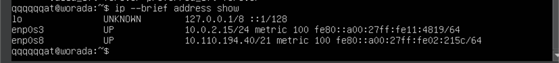

# **IP**
## **บทบาทหน้าที่ของ IP Setup บน Linux** 

IP Setup บน Linux มีความสำคัญมากในการทำให้ระบบ Linux เชื่อมต่อกับเครือข่ายได้อย่างมีประสิทธิภาพ มีบทบาทหน้าที่ ดังนี้

1.	ช่วยให้ Linux สามารถเชื่อมต่อกับเครือข่ายได้อย่างถูกต้อง โดยมีการกำหนดค่า IP Address, Gateway, DNS server 
2.	ช่วยให้ Linux สามารถสื่อสารกับเครือข่ายอื่นๆได้ โดยการกำหนด IP Address และ Gateway จะทำให้ข้อมูลถูกส่งและรับได้อย่างถูกต้อง 
3.	ช่วยให้ Linux สามารถเชื่อมต่อกับอินเทอร์เน็ตได้ เนื่องจากการกำหนด Gateway และ DNS server ให้เครื่อง Linux จะทำให้เครื่อง Linux สามารถเข้าถึงบริการบนอินเทอร์เน็ตหรือเว็บไซต์ได้ 
4.	ช่วยให้ Linux มีความปลอดภัยโดยมีการกำหนดสิทธิ์การเข้าถึงเครือข่ายการใช้งาน Virtual Private Network (VPN)  เพื่อเชื่อมต่อเครือข่ายโดยปลอดภัย และการใช้งานระบบการรับรองตัวตนเพื่อความปลอดภัยของการสื่อสารผ่านเครือข่าย 
5.	ช่วยให้ Linux สามารถใช้งานและเชื่อมต่อกับเครือข่ายได้อย่างมีประสิทธิภาพ 
6.	ช่วยให้ผู้ดูแลระบบสามารถปรับแต่งและดูแลระบบเครือข่ายของ Linux ได้อย่างมีประสิทธิภาพ โดยการใช้เครื่องมือและคำสั่งต่าง ๆ เช่น ip, ifconfig, route เป็นต้น

 

## **พื้นฐานหรือหลักการทำงาน IP บน Linux** 

### **หลักการทำงานของ IP บน Linux:**

    เกี่ยวข้องกับการจัดการและควบคุมการสื่อสารระหว่างคอมพิวเตอร์ภายในเครือข่ายและระบบอินเทอร์เน็ตโดยใช้โปรโตคอล IP (Internet Protocol) ที่เป็นพื้นฐานสำหรับการสื่อสารข้อมูลในเครือข่ายคอมพิวเตอร์ระดับโลก (Internet) หรือเครือข่ายภายในองค์กร (Intranet) โดยมีหลักการทำงานดังนี้:

1. **การกำหนดและการจัดการที่อยู่ IP (IP Address Assignment and Management)** : Linux ใช้ IP address เพื่อระบุตำแหน่งและแยกแยะเครื่องคอมพิวเตอร์ในเครือข่าย การกำหนดและการจัดการที่อยู่ IP นั้นเกิดขึ้นผ่านการกำหนดค่าเครือข่ายในไฟล์ configuration หรือโดยใช้คำสั่งต่าง ๆ เช่น ip, ifconfig, system-config-network เป็นต้น

2. **การสื่อสารแบบแพ็กเกจ (Packet Communication)** :  
เมื่อเครื่องคอมพิวเตอร์ต้องการสื่อสารกับเครื่องอื่น ๆ ในเครือข่าย จะต้องทำการส่งข้อมูลในรูปแบบของแพ็กเกจ (packet) ผ่านเครือข่าย แต่ละแพ็กเกจจะมีหัวและส่วนข้อมูล หัวของแพ็กเกจจะประกอบด้วยข้อมูลเชิงพื้นฐานเช่น ที่อยู่ IP ของส่งข้อมูลและผู้รับ และส่วนข้อมูลจะเป็นข้อมูลจริงที่ต้องการส่ง

3. **การส่งและการได้รับแพ็กเกจ (Packet Transmission and Reception)** :  
เมื่อแพ็กเกจถูกสร้างขึ้นโดยโปรแกรมบนเครื่องคอมพิวเตอร์ ระบบปฏิบัติการจะใช้โปรโตคอล IP เพื่อทำการส่งแพ็กเกจผ่านทางเครือข่ายไปยังเครื่องปลายทาง และเมื่อเครื่องปลายทางได้รับแพ็กเกจ ระบบปฏิบัติการจะดำเนินการส่งข้อมูลถึงโปรแกรมหรือบริการที่เกี่ยวข้อง 

4. **การเรียนรู้และการแจกแจงเส้นทาง (Routing)** :  
เมื่อแพ็กเกจถูกส่งออกไปยังเครือข่ายอื่นๆ ระบบปฏิบัติการจะต้องตัดสินใจเส้นทางที่เหมาะสมในการส่งแพ็กเกจ ซึ่งนั่นเกิดขึ้นผ่านกระบวนการที่เรียกว่า routing ซึ่งจะถูกจัดการโดยระบบปฏิบัติการหรือโปรแกรมส่วนเสริมที่เกี่ยวข้อง 

5. **การสนับสนุนการสร้างและการใช้งานเซอร์วิสต่าง ๆ (Service Support)** :  
IP บน Linux สนับสนุนการทำงานของหลายเซอร์วิสที่เกี่ยวข้องกับเครือข่าย เช่น DNS, DHCP, HTTP, FTP เป็นต้น การกำหนดค่า IP ที่ถูกต้องจำเป็นสำหรับการใช้งานเซอร์วิสเหล่านี้ในระบบ Linux 

6. **การป้องกันและการตรวจจับ (Security and Monitoring)** :  ระบบปฏิบัติการ Linux มีเครื่องมือและการตั้งค่าที่ช่วยในการป้องกันและตรวจจับการบุกรุกเครือข่าย โดยมีการตั้งค่า Firewall, การใช้งาน Virtual Private Network (VPN), การตั้งค่าการรับรองตัวตน เป็นต้น 

## **การเรียกใช้งานและผลลัพธ์ที่ได้** 

### **ค้นหาที่อยู่ IP**
หากต้องการค้นหาที่อยู่ IP ของระบบ Linux ให้ใช้คำสั่ง `ip` ตามด้วยตัวเลือก ที่อยู่ `addr` หรือ `a: 
ip address / ip a`
        
    คำสั่งนี้จะแสดงการกำหนดค่าของอินเทอร์เฟซเครือข่ายทั้งหมดรวมถึงที่อยู่ IP 

ในตัวอย่างต่อไปนี้ จะเห็นว่าระบบมีอินเทอร์เฟซเครือข่ายสามอินเทอร์เฟซ: lo (ที่อยู่ย้อนกลับ), enp0s3 และ enp0s8 ผลลัพธ์ประกอบด้วยข้อมูลต่อไปนี้ :

**ข้อมูลเลเยอร์ 1** เช่น ความสามารถของอินเทอร์เฟซและสถานะการเชื่อมต่อฟิสิคัลเลเยอร์, MTU, สถานะการทำงานของอินเทอร์เฟซ (เช่น ขึ้นหรือลง) และความยาวของคิวการส่ง 

**ข้อมูลเลเยอร์ 2** เช่นที่อยู่ MAC ของอินเทอร์เฟซ 

**ข้อมูลเลเยอร์ 3** รวมถึงที่อยู่ IP และประเภท (ที่อยู่ IP แบบไดนามิกหรือที่อยู่ IP แบบคงที่) 

หากต้องการแสดงข้อมูลโดยย่อเกี่ยวกับอินเทอร์เฟซเครือข่าย ให้ใช้คำสั่ง `ip` พร้อมตัวเลือก `--brief` ดังนี้:

    ip --brief address show

หากต้องการแสดงเฉพาะข้อมูลที่อยู่ IPv4 ให้ใช้คำสั่งต่อไปนี้ : 

    ip -4 addr

หากต้องการค้นหาข้อมูลที่อยู่ IP ของอินเทอร์เฟซเครือข่ายเฉพาะ ให้ใช้คำสั่งต่อไปนี้ : 

    ip address show dev [interface]

ตัวอย่างเช่น หากต้องการดูที่อยู่ IP ของอินเทอร์เฟซเครือข่าย enps03 คำสั่งจะเป็น :

    ip address show dev enps03 

## **ดูที่อยู่ MAC ของระบบ Linux** 

เมื่อใช้คำสั่ง ip คณสามารถดูและเปลี่ยนที่อยู่ MAC ของระบบของคุณได้ 
หากต้องการดูที่อยู่ MAC ของระบบ Linux ให้ใช้คำสั่งต่อไปนี้ : 

    ip --brief link show 

หากต้องการดูที่อยู่ MAC ของอินเทอร์เฟซเฉพาะ ให้ใช้ : 

    ip --brief link show dev [interface] 

## **เพิ่ม/ลบที่อยู่ IP บน Linux**

ในการเพิ่มที่อยู่ IP ให้กับอินเทอร์เฟซเครือข่าย ให้ใช้คำสั่งต่อไปนี้ : 

    ip addr add [ip-address] dev [interface] 

ในการเพิ่มที่อยู่ IP 10.0.2.17/24 ไปยังอินเทอร์เฟซเครือข่าย enps03 คำสั่งจะเป็น : 

    ip addr add 10.0.2.17/24 dev enps03 

หากต้องการลบที่อยู่ IP 10.0.2.17/24 ออกจากอินเทอร์เฟซ enps03 คำสั่งจะเป็น : 

    ip addr del 10.0.2.17/24 dev enps03 

## **ดูตารางเส้นทางบน Linux** 

คำสั่ง `ip route` ใช้เพื่อดูและแก้ไขเส้นทางในระบบ Linux หากต้องการแสดงตารางเส้นทางของระบบ ให้ใช้คำสั่ง  
    
    ip route 

## **แก้ไขตารางเส้นทางโดยใช้ ip** 

หากต้องการเพิ่มเส้นทางด้วยตนเอง ให้ใช้คำสั่ง `ip route` ตามด้วยที่อยู่เครือข่ายปลายทางและ IP ของเกตเวย์ :

    sudo ip route add [network-id] via [gateway-ip] 

ตัวอย่างเช่น หากต้องการเพิ่มเส้นทางที่ส่งการรับส่งข้อมูลทั้งหมดที่ปลายทางสำหรับเครือข่าย 172.20.10.0/28 ไปยังเกตเวย์ที่ 172.20.10.1 คุณจะต้องใช้คำสั่งต่อไปนี้ : 

    sudo ip route add 172.20.10.0/28 via 172.20.10.1 

 หากต้องการลบรายการตารางเส้นทาง ให้ใช้ไวยากรณ์ต่อไปนี้ : 

    sudo ip route delete [network-address] via [gateway-ip] 

คุณยังสามารถดูเส้นทางที่อยู่โดยใช้คำสั่งต่อไปนี้ : 

    ip route get [ip-address] 

## **จัดการ Neighbor Table บน Linux**

คุณสามารถใช้คำสั่ง `ip neigh ใน Linux` เพื่อดูและแก้ไขตารางเพื่อนบ้าน หรือที่เรียกว่าตาราง `ARP` หากต้องการดูรายการตารางเพื่อนบ้านปัจจุบัน ให้ใช้คำสั่งต่อไปนี้:

    ip neigh show 

## **เพิ่มสีให้กับผลลัพธ์ของคำสั่ง Ip**

เพื่อให้เอาต์พุตเข้าใจได้ง่ายและเร็วขึ้น คุณสามารถเพิ่มสีให้กับเอาต์พุตคำสั่ง `ip` โดยใช้ตัวเลือก `-c` : 

    ip -c a

 

# **IP Address ( internet Protocal Address )**

คือหมายเลขประจำเครื่องคอมพิวเตอร์แต่ละเครื่องในระบบเครือข่ายที่ใช้โปรโตคอลแบบ TCP/IP สามารถบอกได้ว่าเครื่องคอมพิวเตอร์ตั้งอยู่ที่ไหน ซึ่งสามารถระบุได้ผ่าน ip address 
IP address เป็นตาม class จะได้ดังนี้ 

- `Class A` มีตัวเลข 0.0.0.0 ถึง 127.255.255.255 เหมาะสำหรับองค์กรขนาดใหญ่ มีผู้ใช้งานจำนวนมาก สามารถกำหนดเลข ip address ได้ถึง 16 ล้านหมายเลข 

- `Class B` มีตัวเลข 128.0.0.0 ถึง 191.255.255.255 เหมาะสำหรับองค์กรขนาดกลาง กำหนดเลขสำหรับผู้ใช้งานประมาณ 65,000 หมายเลข 

- `Class C` มีตัวเลข 192.0.0.0 ถึง 223.255.255.255 เหมาะสำหรับเครื่องคอมพิวเตอร์ภายในเครื่องข่ายได้จำนวนหมายเลข 254 หมายเลข 

- `Class D` มีตัวเลข 224.0.0.0 ถึง 239.255.255.255 จะใช้ในเครือข่ายแบบ Multitask เท่านั้น 

- `Class E` เป็น Class สำหรับอนาคต จึงยังไม่ได้กำหนดรูปแบบการใช้งาน 

## **ช่องโหว่ที่สามารถเกิดขึ้นได้**

1.	มีช่องโหว่ในการตั้งค่าผ่านทางคำสั่ง ทำให้ผู้ไม่ประสงค์ดีสามารถเข้าถึงระบบหรือเปลี่ยนแปลงการตั้งค่าได้ 
2.	ช่องโหว่ในการตั้งค่าผ่านทางการแก้ไขไฟล์คอนฟิก 
3.	ช่องโหว่การรักษาความปลอดภัย เช่น การไม่ระบุสิทธิ์การเข้าถึงไฟล์การกำหนดค่า IP หรือการไม่ใช้การเข้ารหัสในการสื่อสารระหว่างระบบ 
4.	การใช้โปรโตคอลที่ไม่ปลอดภัยหรือไม่ได้รับการสนับสนุนอย่างเพียงพอ อาจทำให้เกิดช่องโหว่ในการรับส่งข้อมูล 
5.	ระบบอาจมีช่องโหว่ในการทำงานที่สามารถถูกโจมตีได้ผ่านทางการส่งข้อมูลหรือการเชื่อมต่อกับเครือข่าย 

## **Bus ที่เจอ**

ทีมนักวิจัยจากมหาวิทยาลัยวาเลนเซียได้ค้นพบบั๊คแปลกๆบนระบบปฏิบัติการ Linux หลาย Distribution ที่ช่วยให้ใครก็ได้สามารถบายพาสการพิสูจน์ตัวตนของเครื่องระหว่างการบูท เพียงแค่กดปุ่ม Backspace ติดต่อกัน 28 ครั้ง ช่องโหว่นี้ไม่ได้เกิดจากบั๊คบน Kernel หรือระบบปฏิบัติการเหมือนช่องโหว่ทั่วๆไป แต่เป็นบั๊คที่อยู่ใน Grub2 ซึ่งเป็น Grand Unified Bootloader ยอดนิยมของ Linux หลายๆตัว Grub2 ถูกใช้เพื่อบูทระบบปฏิบัติการขณะเปิดใช้งานเครื่องคอมพิวเตอร์ ต้นตอของปัญหานี้เกิดจากความผิดพลาดของ Integer Overflow ซึ่งส่งผลกระทบต่อฟังก์ชัน grub_password_get() 
ผลกระทบจากช่องโหว่ 

ขณะที่หน้าจอแสดงผลให้ใส่ Grub username แฮ็คเกอร์สามารถกดปุ่ม Backspace 28 ครั้งเพื่อเข้าใช้งาน Grub rescue shell ได้ทันที ซึ่ง Rescue shell ช่วยให้แฮ็คเกอร์สามารถเข้าถึงระบบไฟล์ของคอมพิวเตอร์ได้โดยไม่ต้องพิสูจน์ตัวตนใดๆ แฮ็คเกอร์สามารถขโมยข้อมูล เปลี่ยนแปลงแก้ไข หรือลบข้อมูลได้ รวมไปถึงสามารถติดตั้งมัลแวร์เพื่อใช้งานในอนาคตได้เช่นกัน 

## อภิปราย
https://www.hostinglotus.com/blog/2019/12/16/ip-address-%E0%B8%84%E0%B8%B7%E0%B8%AD%E0%B8%AD%E0%B8%B0%E0%B9%84%E0%B8%A3/ 
https://www.ibm.com/docs/en/power9/0009-ESS?topic=notebook-setting-ip-address-in-linux 
https://chat.openai.com/c/0bbf2de7-64df-4a46-b8ad-dcc59bfc9b4d 
https://www.techtalkthai.com/hack-linux-by-hitting-backspace-28-times/ 

## Reference
https://th.linux-console.net/?p=12371 
https://chat.openai.com/c/94882a20-afe5-4a17-8129-4b8e65448c13 
