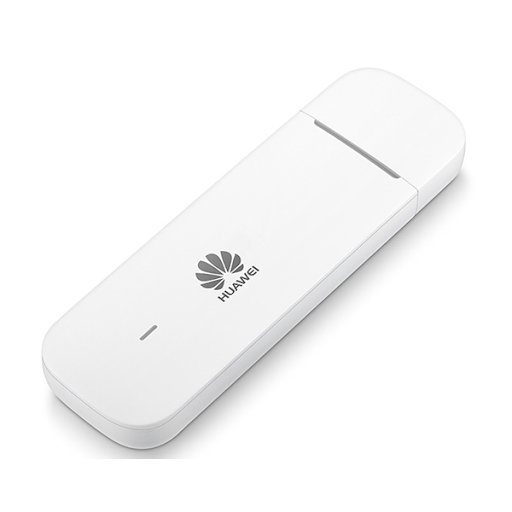
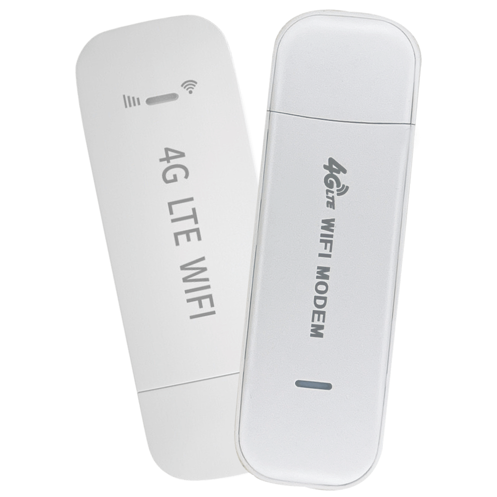
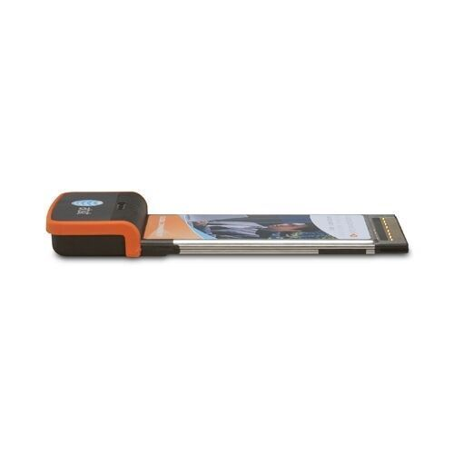

# Aircard Adaptor
 Aircard คือ อุปกรณ์โมเด็มอย่างหนึ่งที่ใช้เพื่อเชื่อมต่อเครื่องคอมพิวเตอร์ Desktop หรือ Laptop เข้าสู่โลกอินเทอร์เน็ตแบบไร้สายความเร็วสูงโดยผ่านโครงข่ายสัญญาณ
 โทรศัพท์มือถือที่ใช้เทคโนโลยีที่เรียกว่า GPRS และ EDGE ซึ่งในขณะที่เชื่อมต่อเข้าสู่โลกอินเทอร์เน็ตไป ก็ยังสามารถใช้โทรศัพท์โทร เข้า-ออก ได้ในเวลาเดียวกัน เพราะระบบมีการใช้ช่องสัญญาณคนละช่องสัญญาณกัน แต่ใช้
 Cellsite (คอลไซต์) เดียวกัน หรือทำหน้าที่เป็นแฟ็กซ์ไร้สายได้ด้วย 
 การเชื่อมต่อ Aircard แบ่งออกได้ 2 ประเภท 
    1.เชื่อมต่อผ่านพอร์ต USB 
    2.เชื่อมต่อผ่านพอร์ต PCMCIA 
      ความเร็วในการเชื่อมต่อจะอยู่ประมาณ 460 KBPS บางรุ่นมีความเร็วสูงสุดถึง 7.2 MBPS 3G (ขึ้นกับอยู่สัญญาณที่ใช้งาน)
    <br>
    
    

## ประเภทของ Aircard
โมเด็มไร้สาย AirCard มีรูปแบบมาตรฐานสามแบบ และแต่ละรูปแบบต้องใช้พอร์ตหรือช่องที่เข้ากันได้บนแล็ปท็อปเพื่อให้ทำงานได้อย่างถูกต้อง
- `การ์ดพีซี PCMCIA`
    การ์ดโมเด็มเซลลูล่าร์มาตรฐานดั้งเดิมสำหรับคอมพิวเตอร์
- `ExpressCard`
    เพิ่มแบนด์วิดท์ผ่านการ์ด PCMCIA ที่ถูกแทนที่
- `USB Modem`
    ให้การเชื่อมต่อเซลลูล่าร์กับคอมพิวเตอร์ทุกเครื่องที่มีพอร์ต USB

## คุณสมบัติที่ควรมีใน Aircard Adaptor

1. สามารถรองรับระบบปฏิบัติการได้หลากหลายระบบ เช่น Window Vista, Window XP, Window ME, Window 2000 หรือ Mac OSX ใช้งานโดยเสียบเข้ากับ Port ยูเอสบี ได้ หรือไม่ก็ใช้ช่อง Slot PCMCIA ของ Labtop
2. สามารถอัพเกรดเฟิร์มแวร์ได้ โดยใช้งานได้ทั้งกับเครือข่าย UMTS/ EDGE/ GSM
3. สามารถรองรับซิมของระบบโทรศัพท์มือถือบ้านเราได้ทุกค่าย รองรับระบบ 3G และ EDGE Class 12/ GPRS Class 12
4. รองรับการใช้งาน Voice หรือส่ง SMS
5. รองรับการใช้งานด้านโทรศัพท์และการใช้งานแฟ็กซ์
6. ควรเลือก Aircard ที่กินไฟน้อย เพราะเหมาะสำหรับการใช้งานกับเครื่องโน้ตบุ๊ค หากเราใช้ Aircard ที่กินไฟมากๆ พลังงานในแบตเตอรี่ของเครื่องก็จะหมดเร็วไปด้วย

## คำสั่งต่างๆเกี่ยวกับ Aircard Adaptor
- คำสั่ง ifconfig : ใช้ในการแสดงข้อมูลและเปลี่ยนค่า interface server
- คำสั่ง lspci : แสดงรายการอุปกรณ์ PCI ทั้งหมด
- คำสั่ง lsusb : ใช้สำหรับแสดงรายการอุปกรณ์ USB ที่เชื่อมต่อ
- คำสั่ง lshw : ระบุอินเทอร์เฟซอีเทอร์เน็ตและฮาร์ดแวร์ NIC
- คำสั่ง ifup/ifdown  : ใช้เปิด/ปิด interface เครือข่าย
- คำสั่ง hwinfo : Probe Linux สำหรับการ์ดเครือข่าย

## ตัวอย่าง Code การเรียกใช้งาน
- ifconfig
Code การเรียกใช้ :
```
ifconfig
```
Output :


- iwconfig 
Code การเรียกใช้ :
```
iwconfig 
```
Output :


- lsusb
Code การเรียกใช้ :
```
lsusb -t 
```
Output :
```
/:  Bus 02.Port 1: Dev 1, Class=root_hub, Driver=ehci-pci/2p, 480M
    |__ Port 1: Dev 2, If 0, Class=Hub, Driver=hub/6p, 480M
        |__ Port 1: Dev 4, If 0, Class=Audio, Driver=snd-usb-audio, 12M
        |__ Port 1: Dev 4, If 1, Class=Audio, Driver=snd-usb-audio, 12M
        |__ Port 1: Dev 4, If 2, Class=Audio, Driver=snd-usb-audio, 12M
        |__ Port 1: Dev 4, If 3, Class=Human Interface Device, Driver=usbhid, 12M
/:  Bus 01.Port 1: Dev 1, Class=root_hub, Driver=ehci-pci/2p, 480M
    |__ Port 1: Dev 2, If 0, Class=Hub, Driver=hub/4p, 480M
        |__ Port 1: Dev 3, If 0, Class=Human Interface Device, Driver=usbhid, 1.5M
        |__ Port 1: Dev 3, If 1, Class=Human Interface Device, Driver=usbhid, 1.5M
        |__ Port 2: Dev 4, If 0, Class=Human Interface Device, Driver=usbhid, 1.5M
```

## ตัวอย่างวิธีการใช้ NETGEAR Aircard บนระบบปฏิบัติการ Linux
❗❗ต้องใช้ไดรเวอร์ USB NETGEAR AirCard เวอร์ชัน 1.7.0 หรือสูงกว่า โดยใช้คำสั่ง modinfo sierra เพื่อตรวจสอบเวอร์ชัน❗❗

ไดรเวอร์ NETGEAR sierra_net.c นำเสนอโมเด็ม NETGEAR AirCard บางรุ่นให้กับระบบปฏิบัติการเป็นการ์ดอินเทอร์เฟซเครือข่าย (NIC) อินเทอร์เฟซการสื่อสารข้อมูลระหว่างโฮสต์และโมเด็มจะถ่ายโอนแพ็กเก็ตซึ่งมีเฟรมอีเธอร์เน็ตผ่านบัส USB และใช้แบนด์วิดท์ USB ความเร็วสูงอย่างมีประสิทธิภาพมากขึ้น เพิ่มปริมาณการรับส่งข้อมูลอย่างมาก โดยเฉพาะอย่างยิ่งเมื่อรวมกับกลไกอื่นๆ ที่ปรับการใช้งานบัสให้เหมาะสมสำหรับแพ็กเก็ตผู้ใช้ มีขั้นตอนดังนี้ 

### Driver Downloads
Driver (และอาจเป็นไฟล์อื่น ๆ ขึ้นอยู่กับเคอร์เนลของคุณ) จะรวมเข้าด้วยกันเป็นไฟล์เดียว เมื่อคุณดาวน์โหลดไฟล์แล้ว สามารถแตกเนื้อหาได้ตามตอนต่อไปนี้:
1. สร้าง Directory สำหรับ tarfile
    ```
    # mkdir kernel-2.6.y
    ```
2. ย้ายไฟล์ tar ที่คุณดาวน์โหลดจากเว็บไซต์นี้ไปยัง Directory ใหม่
    ```
    # mv  v1.xx_kernel2.6.y.directIP.tar  kernel-2.6.y
    ```
3. แตกไฟล์ลงใน Directory ใหม่
    ```
    # tar -xvf v1.xx_kernel-2.6.y.directIP.tar
    ```

#### 1. Downloaded file contents
ไฟล์ที่ดาวน์โหลดประกอบด้วย
1. sierra.c <br>
Driver file นี้จัดการอินเทอร์เฟซ USB แบบอนุกรมของโมเด็มและจำเป็นสำหรับการดำเนินการ IP โดยตรง ประกอบด้วยรายการ interface ที่ถูกบล็อกซึ่งต้องละเว้น interface USB ที่จัดการโดย Driverนี้จะถูกเปิดเผยใน Directory /dev/ เป็น /dev/ttyUSBn
โดยในกรณีส่วนใหญ่ "n" จะมีค่าตั้งแต่ 0 ถึง 6 หรือสูงกว่า ขึ้นอยู่กับผลิตภัณฑ์ Driver นี้จำเป็นสำหรับผลิตภัณฑ์ที่ใช้ NETGEAR USB ทั้งหมด
2. sierra_net.c <br>
Driver นี้มีไว้สำหรับการทำงาน Direct IP โดยเฉพาะ 
ทำให้โมเด็ม NETGEAR AirCard ปรากฏบนเครื่อง Linux ของคุณเป็นอุปกรณ์ที่มีลักษณะคล้าย Ethernet อย่างน้อยหนึ่งเครื่อง ขึ้นอยู่กับการกำหนดค่าของโมเด็ม
3. Makefile <br>
ประกอบไปด้วยคำแนะนำที่คอมพิวเตอร์ Linux ต้องการในการสร้างและติดตั้งไดรเวอร์ sierra.c และ sierra_net.c
4. usbnet.h  , skb_compat.h <br>
ไฟล์นี้จำเป็นสำหรับไดรเวอร์ sierra_net.c และจัดเตรียมไว้เป็นส่วนหนึ่งของการดาวน์โหลดนี้ในกรณีที่ไม่พร้อมใช้งานบนคอมพิวเตอร์ Linux

#### 2. Driver Installation
การติดตั้ง Driver เหล่านี้,uกระบวนการสองขั้นตอน ประกอบไปด้วยการคอมไพล์และการติดตั้ง user ทั่วไปสามารถดำเนินการขั้นตอนการคอมไพล์ได้ แต่ขั้นตอนการติดตั้งสามารถทำได้โดย user ที่เป็น root เท่านั้น
1. Compiling the driver
    - นำทางไปยังไดเร็กทอรีที่คุณได้แตกไฟล์ Driver ของคุณ
    ```
     # cd <เส้นทางไดเรกทอรี>
    ```
    - รวบรวม Driver ด้วยคำสั่งต่อไปนี้ 
    ```
    # make
    ```
2. Installing the driver
    - ตรวจสอบให้แน่ใจว่าโมเด็ม NETGEAR ไม่ได้เสียบเข้ากับคอมพิวเตอร์
    - ติดตั้งไดรเวอร์โดยใช้คำสั่ง
    สำหรับ  user ที่เป็น root
    ```
    # make install
    ```
    สำหรับ user ทั่วไป
    ```
    sudo make install
    ```

3. Verify your installation
    - ตรวจสอบหมายเลขเวอร์ชันของ Driver โดยใช้คำสั่งต่อไปนี้
    ```
    # modinfo sierra ควรเห็น v.1.7.x หรือใหม่กว่า
    ```
    ```
    # modinfo sierra_net ควรเห็น v.1.xx หรือใหม่กว่า
    ```
    - เสียบโมเด็มเข้ากับการเชื่อมต่อ USB ของคอมพิวเตอร์
    จะเห็นตัวจัดการไฟล์หลายไฟล์ปรากฏในไดเร็กทอรี /dev ตรวจสอบโดยใช้คำสั่งต่อไปนี้
    ```
    # ls /dev/ttyUSB*
    ```
    การตอบสนองควรมีลักษณะประมาณนี้:
    /dev/ttyUSB0
    /dev/ttyUSB1
    /dev/ttyUSB2 
    /dev/ttyUSB3
    ตรวจสอบเพื่อดูว่ามีการแจกแจงอินเทอร์เฟซ IP โดยตรงของโมเด็มหรือไม่
    ```
    #ifconfig
    ```
    ผลลัพธ์ควรมีลักษณะดังต่อไปนี้
    ```
    usb0 Link encap:Ethernet HWaddr 00:1e:37:21:9c:80
              inet addr:10.1.32.113 Bcast:10.1.32.255 Mask:255.255.255.0
              inet6 addr: fe80::21e:37ff:fe21:9c80/64 Scope:Link
              DOWN BROADCAST RUNNING MULTICAST MTU:1500 Metric:1
              RX packets:14288 errors:0 dropped:0 overruns:0 frame:0
              TX packets:639 errors:0 dropped:0 overruns:0 carrier:0
              collisions:0 txqueuelen:1000
              RX bytes:1674202 (1.5 MB) TX bytes:106755 (104.2 KB)
              Interrupt:21
    ```
#### 3. Connecting to the Network
1. Connecting to Aircard
    - เชื่อมต่อกับโมเด็มโดยใช้คำสั่ง
    ```
    # minicom –s
    ```
2. Setup the APN
    - สามารถแก้ไขหรือสร้างโปรไฟล์ใหม่ได้โดยใช้คำสั่ง
    ```
    at+cgdcont =<pid>,"IP","APN"
    ```
    ** โดยที่ “PID” คือรหัสโปรไฟล์ที่ระบุโปรไฟล์ ซึ่งโดยทั่วไปคือโปรไฟล์ 1 **
    ตัวอย่าง :
    ```
    AT&T:  at+cgdcont=1,”IP”,”broadband”
            Telstra: at+cgdcont=1,”IP”,”Telstra.internet”
            Rogers LTE:  at+cgdcont=1,”IP”,”lteinternet.apn “
            Rogers:  at+cgdcont=1,”IP”,”internet.com “
            Telus:  at+cgdcont=1,"IP","isp.telus.com"
            Bell: at+cgdcont=1,"IP","inet.bell.ca"

    ```
3. Set Radio On
- เมื่อใช้ Aircard ในคอมพิวเตอร์เครื่องอื่นต้องทำให้ Radio On โดยใช้คำสั่ง
```
at+cfun =1
```
ใน CDMA modems ใช้คำสั่ง
```
at!pcstate =1
```
หากต้องการสั่งปิด ใช้คำสั่ง
```
at+cfun=0
```
4. Establishing a manual connection
คำสั่งต่อไปนี้ใช้เพื่อเชื่อมต่อหรือยกเลิกการเชื่อมต่อกับโมเด็ม IP โดยตรง
หากต้องการเชื่อมต่อด้วยตนเอง :
```
at!scact=1,<pid>
```
หากต้องการตัดการเชื่อมต่อด้วยตนเอง : 
```
at!scact=0,<pid>
```
5. IP address obtained by carrier
หากต้องการตรวจสอบที่อยู่ IP ที่โมเด็มได้รับจากเครือข่าย ให้ใช้:
```
at!scpaddr=<pid>
```
## ข้อควรระวัง❗❗❗
จะต้องปิดการใช้งานในพื้นที่ที่อาจเสี่ยงต่อการรบกวนทางวิทยุ โดยเฉพาะ:
- ใกล้อุปกรณ์ทางการแพทย์หรือเครื่องช่วยชีวิต <br>
อุปกรณ์ทางการแพทย์อาจเสี่ยงต่อการรบกวนทางวิทยุทุกรูปแบบ
- บนเครื่องบิน <br>
นอกเหนือจากข้อกำหนดของ Federal Aviation Authority (FAA) แล้ว กฎระเบียบของสายการบินหลายแห่งยังระบุว่าต้องระงับการทำงานแบบไร้สายก่อนขึ้นเครื่องบิน เพราะ โมเด็มสามารถส่งสัญญาณที่อาจรบกวนระบบและการควบคุมออนบอร์ดต่างๆได้
การไม่ปฏิบัติตามคำแนะนำนี้อาจนำไปสู่การระงับหรือปฏิเสธเซลลูล่าร์
บริการโทรศัพท์แก่ผู้กระทำผิด การดำเนินคดี หรือทั้งสองอย่าง

## 📚 Reference
- https://www.mindphp.com/%E0%B8%84%E0%B8%B9%E0%B9%88%E0%B8%A1%E0%B8%B7%E0%B8%AD/73-%E0%B8%84%E0%B8%B7%E0%B8%AD%E0%B8%AD%E0%B8%B0%E0%B9%84%E0%B8%A3/4047-what-is-air-card.html
- https://www.gotoknow.org/posts/439268
- https://kb.netgear.com/22869/Can-I-use-a-NETGEAR-AirCard-Modem-on-Linux-Machines-direct-IP-modems
- https://www.cyberciti.biz/faq/linux-list-network-interfaces-names-command/
- https://www.cyberciti.biz/faq/linux-list-network-cards-command/
- https://www.lifewire.com/what-is-an-aircard-818325
- https://www.geeksforgeeks.org/iwconfig-command-in-linux-with-examples/
- https://www.lifewire.com/what-is-an-aircard-818325
- https://th.linux-console.net/?p=19836
- https://montienfocus.blogspot.com/2015/12/raspberry-pi-aircard-3g.html
- https://www.downloads.netgear.com/files/aircard/2131232_AirCard_USB_Modem_User_Guide_r9.pdf