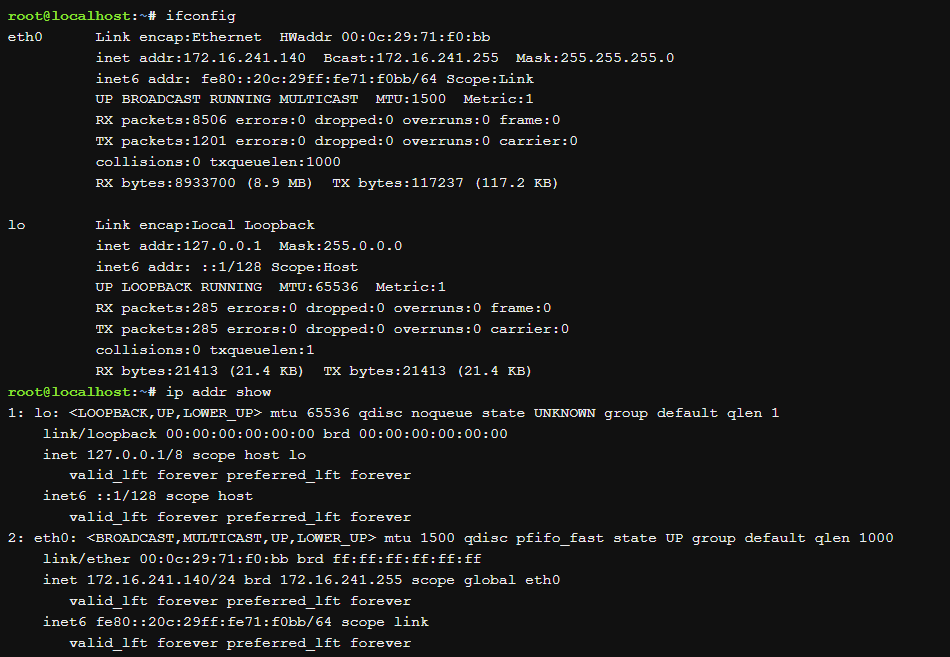

# LAN Card

## การ์ดเครือข่าย (Network Interface Card - NIC) 

เป็นอุปกรณ์ hardware ที่เป็นบอร์ดวงจรหรือชิปที่ติดตั้งบนคอมพิวเตอร์เพื่อใช้ในการเชื่อมต่อสายสัญญาณของเครือข่าย ติดตั้งไว้ในเครื่องคอมพิวเตอร์ที่เป็นเครื่องแม่ข่าย และเครื่องที่เป็นลูกข่าย เพื่อให้สามารถสื่อสารกับเครื่องคอมพิวเตอร์อื่น ๆ ในเครือข่าย ซึ่งในปัจจุบันการ์ดเครือข่ายรุ่นใหม่มีฟังก์ชันที่ให้ความสามารถแก่คอมพิวเตอร์ เช่น การสนับสนุนสัญญาณ input/output interrupt, การทำ direct-memory access และการถ่ายโอนข้อมูล

## ชนิดของ NICs

โดยทั่วไปมาตรฐานของ NIC คือบอร์ดวงจรที่เสียบเข้ากับคอมพิวเตอร์เพื่อเชื่อมต่อกับเมนบอร์ด การเชื่อมต่อมีหลายวิธีดังนี้ :

- `Wireless (ไร้สาย)` : NICs ใช้เสาอากาศเพื่อให้การรับสัญญาณไร้สายผ่านคลื่นความถี่วิทยุเพื่อการเชื่อมต่อ Wi-Fi ใช้ NICs แบบไร้สาย
- `Wired (ทางสาย)` : NICs มีจานรับสำหรับสาย Ethernet เป็นเทคโนโลยี LAN ทางสายที่ได้รับความนิยมที่สุด
- `USB` : NICs ที่ให้การเชื่อมต่อเครือข่ายผ่านอุปกรณ์ที่เสียบเข้ากับพอร์ต USB
- `Fiber optics` : NICs ที่ใช้เป็นระบบสนับสนุนที่มีความเร็วสูงสำหรับการจัดการการจราจรเครือข่ายบนเซิร์ฟเวอร์. ยังสามารถทำได้โดยการรวม NICs หลายตัว. NICs ทางไฟเบอร์ออปติกมักจะมีราคาสูงและซับซ้อนมากขึ้น

## หน้าที่ของ LAN Card หรือ NIC

มีหน้าที่ให้คอมพิวเตอร์เชื่อมต่อกับเครือข่ายอย่างต่อเนื่อง ทำงานในชั้น physical, สำหรับการสื่อสารกับมาตรฐานของชั้นข้อมูลเช่น Ethernet หรือ Wi-Fi โดยแปลงสัญญาณจากคอมพิวเตอร์ส่งผ่านไปตามสายสัญญาณ ทำให้คอมพิวเตอร์ในเครือข่ายแลกเปลี่ยนข้อมูลข่าวสารกันได้


- เป็นตัวกลางระหว่างคอมพิวเตอร์และเครือข่ายข้อมูล
  - เมื่อผู้ใช้ร้องขอหน้าเว็บ คอมพิวเตอร์จะส่งคำขอไปยังการ์ดเครือข่ายที่จะแปลงมันเป็นสัญญาณไฟฟ้า 

  - เซิร์ฟเวอร์เว็บบนอินเทอร์เน็ตรับสัญญาณและตอบโดยการส่งหน้าเว็บกลับไปที่การ์ดเครือข่ายเป็นสัญญาณไฟฟ้า การ์ดจะรับสัญญาณเหล่านี้และแปลงมันเป็นข้อมูลที่คอมพิวเตอร์แสดง
- แต่ละการ์ดแทนอุปกรณ์และที่มีสามารถทั้งเตรียม-ส่งออก และควบคุมการไหลของข้อมูลในเครือข่ายได้

- คอนโทรลเลอร์เครือข่าย เคยถูกนำมาใช้เป็นการ์ดเสริมที่สามารถเสียบเข้ากับพอร์ตคอมพิวเตอร์ หรืออุปกรณ์ USB แต่คอนโทรลเลอร์ที่ทันสมัยมักถูกนำมาติดตั้งโดยตรงในชิปเซ็ตบนเมนบอร์ดคอมพิวเตอร์ ผู้ใช้สามารถซื้อ NIC ในรูปแบบการ์ดเสริมออนไลน์หรือที่ร้านค้าปลีกถ้าต้องการการเชื่อมต่อเครือข่ายที่เป็นอิสระเพิ่มเติม เมื่อผู้ใช้เลือก NIC สเปกของมันควรสอดคล้องกับมาตรฐานของเครือข่าย

## หน้าที่ของ LAN Card บนระบบปฏิบัติการ Linux

Network Interface Card (NIC) มีบทบาทหลากหลายที่ทำให้ระบบเครือข่ายทำงานบน Linux ดังนี้ :

- การตั้งค่า Network Interface :

  - NIC มีหน้าที่ในการตั้งค่าอินเตอร์เฟซของเครือข่ายบน Linux การใช้คำสั่งที่เกี่ยวข้องเช่น `ifconfig`, `ip`, หรือ `nmcli` เพื่อกำหนดค่า IP address, subnet mask, gateway และอื่น ๆ

- การดูข้อมูล Network Interface :

  - NIC ให้ข้อมูลเกี่ยวกับสถานะและค่าต่าง ๆ ของอินเตอร์เฟซ เช่น IP address, MAC address และสถานะการเชื่อมต่อ คำสั่งที่ใช้สำหรับการดูข้อมูลรวมถึง `ifconfig`, `ip`, และ `ethtool`

- การจัดการการเชื่อมต่อ :

  - NIC มีบทบาทในการจัดการและควบคุมการเชื่อมต่อ เช่น การรับ-ส่งข้อมูลระหว่างเครื่องคอมพิวเตอร์กับเครือข่าย เมื่อมีข้อมูลที่ต้องการส่ง NIC จะทำการสร้าง packet และส่งไปยังเครือข่าย, NIC จะรับข้อมูลจากเครือข่ายและนำเข้าระบบ

- การสนับสนุนการโอนข้อมูล :

  - NIC มีความสามารถในการสนับสนุนการโอนข้อมูลด้วยวิธีต่าง ๆ เช่น DMA (Direct Memory Access) ช่วยให้ NIC สามารถโอนข้อมูลระหว่าง RAM ของคอมพิวเตอร์และ Buffer ของ NIC โดยไม่ต้องผ่านทาง CPU วิธีนี้ช่วยลดการใช้ทรัพยากรของ CPU ในกระบวนการถ่ายโอนข้อมูล


## หลักการทำงานของ LAN Card บน Linux

### ตรวจสอบการติดตั้ง LAN Card :
ให้เช็คว่า LAN card ได้รับการติดตั้งแล้วหรือไม่ ในส่วนมากจะมีการรับรองจาก Linux ในการตรวจจับและติดตั้งได้โดยอัตโนมัติ

ให้ใช้คำสั่ง `lspci` เพื่อแสดงรายการของ hardware ทั้งหมดที่ติดตั้งบนระบบ

### Syntax ของคำสั่ง `lspci` :

```
lspci [options]
```

ใช้คำสั่ง `lspci` ใน Linux เพื่อแสดงรายการของ network card พิมพ์คำสั่ง `lspci` ตามด้วยคำสั่ง `egrep` เพื่อกรองอุปกรณ์ที่เกี่ยวข้อง

```
lspci | egrep -i --color 'network|ethernet'
lspci | egrep -i --color 'network|ethernet|wireless|wi-fi'
```

ผลลัพธ์ที่ได้

```
09:00.0 Ethernet controller: Broadcom Corporation NetXtreme BCM5761e Gigabit Ethernet PCIe (rev 10)
0c:00.0 Network controller: Intel Corporation Ultimate N WiFi Link 5300
```

---

ใช้คำสั่ง `lshw` สามารถดึงข้อมูลรายละเอียดเกี่ยวกับการกำหนดค่า hardware ของเครื่องได้ รวมถึงข้อมูลเกี่ยวกับ network card

```
lshw -class network
```
ผลลัพธ์แสดงรายละเอียดข้อมูล hardware ที่เกี่ยวกับ network card บน Linux
```
  *-network DISABLED      
       description: Wireless interface
       product: Ultimate N WiFi Link 5300
       vendor: Intel Corporation
       physical id: 0
       bus info: pci@0000:0c:00.0
       logical name: wlan0
       version: 00
       serial: 00:21:6a:ca:9b:10
       width: 64 bits
       clock: 33MHz
       capabilities: pm msi pciexpress bus_master cap_list ethernet physical wireless
       configuration: broadcast=yes driver=iwlwifi driverversion=3.2.0-0.bpo.1-amd64 firmware=8.83.5.1 build 33692 latency=0 link=no multicast=yes wireless=IEEE 802.11abgn
       resources: irq:46 memory:f1ffe000-f1ffffff
  *-network
       description: Ethernet interface
       product: NetXtreme BCM5761e Gigabit Ethernet PCIe
       vendor: Broadcom Corporation
       physical id: 0
       bus info: pci@0000:09:00.0
       logical name: eth0
       version: 10
       serial: b8:ac:6f:65:31:e5
       size: 1GB/s
       capacity: 1GB/s
       width: 64 bits
       clock: 33MHz
       capabilities: pm vpd msi pciexpress bus_master cap_list ethernet physical tp 10bt 10bt-fd 100bt 100bt-fd 1000bt 1000bt-fd autonegotiation
       configuration: autonegotiation=on broadcast=yes driver=tg3 driverversion=3.121 duplex=full firmware=5761e-v3.71 ip=192.168.1.5 latency=0 link=yes multicast=yes port=twisted pair speed=1GB/s
       resources: irq:48 memory:f1be0000-f1beffff memory:f1bf0000-f1bfffff
```

แสดงผลลัพธ์แบบสั้น ใช้คำสั่ง

```
sudo lshw -class network -short
```

```
[sudo] password for vivek:
H/W path           Device        Class          Description
===========================================================
/0/100/1d.6/0      wlp82s0       network        Wi-Fi 6 AX200
/0/100/1f.6        eth0          network        Ethernet Connection (7) I219-LM
```

> [!WARNING]
> - โดยปกติแล้วคำสั่ง `lshw` อาจจะยังไม่ได้ถูกติดตั้งในระบบ ใช้คำสั่งดังนี้ เพื่อติดตั้ง `lshw`
>   - `sudo apk add lshw` บน Alpine Linux
>   - `sudo dnf install lshw` หรือ `sudo yum install lshw` บน RHEL
>   - `sudo apt install lshw` หรือ `sudo apt-get install lshw` บน Debian Ubuntu
>   - `sudo zypper install lshw` บน SUSE
>   - `sudo pacman -S lshw` บน Arch Linux 

---

### การกำหนดค่า IP :

หาก LAN card ได้รับการติดตั้งและถูกตรวจจับอย่างถูกต้อง ต้องกำหนดค่า IP address และค่าอื่น ๆ ให้กับ LAN card นั้น ใช้คำสั่ง `ifconfig` หรือ `ip` เพื่อกำหนดค่า IP address

### Syntax ของคำสั่ง `ifconfig` :
```
ifconfig [interface] [options]
```
คำสั่ง `ifconfig` คือการกำหนดค่า interface และใช้เพื่อแสดงข้อมูลการกำหนดค่าเครือข่าย บนเครื่องคอมพิวเตอร์ และสามารถดูข้อมูลเกี่ยวกับ network interface ได้ เช่น IP address, MAC address, network mask เป็นต้น

```
ifconfig
```


Source : https://content.netdevgroup.com/contents/linux-essentials/pvycrLF82S/

คำสั่งนี้แสดงผลลัพธ์รายละเอียดซึ่งรวมถึงข้อมูลเกี่ยวกับ network interface ทั้งหมดที่กำลังทำงาน เช่น ชื่อinterface, ที่อยู่ hardware, ที่อยู่ IP และรายละเอียดการกำหนดค่าอื่น ๆ ของทุกๆ interface ที่ทำงานอยู่ในปัจจุบัน

---


### Syntax ของคำสั่ง `ip`:

```
ip [options] object [command]
```

คำสั่ง ip แตกต่างจาก ifconfig ในหลายทางสำคัญ โดยที่สำคัญที่สุดคือผ่านฟังก์ชั่นและตัวเลือกที่เพิ่มขึ้น มีความสามารถในการปรับแต่งและควบคุมการเชื่อมต่อเครือข่ายของระบบได้โดยใช้คำสั่งเพียงคำสั่งเดียว รูปแบบของคำสั่ง ip มีดังนี้

```
ip addr show
```


Source : https://content.netdevgroup.com/contents/linux-essentials/pvycrLF82S/

ในตัวอย่างนี้ ทั้งคำสั่ง `ifconfig` และ `ip` ถูกใช้เพื่อแสดงข้อมูลทุก interface บนระบบ

## ตรวจสอบ Network บน Linux Server

ในการตรวจสอบ Network บน Linux Server นั้น สิ่งที่ควรจะรู้ได้แก่ IP Address, Subnet Mask, IP Gateway และ IP DNS นอกจากการตรวจสอบแล้วต้องสามารถทำการแก้ไขได้ด้วย ดังรูปตามตัวอย่าง


Source: https://www.jodoi.org/Network%20on%20linux.html

การตรวจสอบ IP Address และ Subnet Mask
เราสามารถตรวจสอบ IP Address ได้ด้วย command `ifconfig` หรือถ้ามี LAN Card หลายใบ สามารถระบุได้ด้วย command `ifconfig eth0` ( eth0 หมายถึง Lan Card ใบที่ 1 )


## 📚 Reference

- https://www.cyberciti.biz/faq/linux-list-network-cards-command/
- https://www.baeldung.com/linux/list-network-cards
- https://www.baeldung.com/linux/network-interface-configure
- https://amod-kadam.medium.com/linux-network-interface-s-minimal-know-how-helped-me-a-lot-168547b471d9
- https://content.netdevgroup.com/contents/linux-essentials/pvycrLF82S/


<!-- การทำงานของ LAN Card ต้องตรวจสอบสถานะและข้อมูลของ LAN Card ที่เชื่อมต่อกับระบบ ซึ่งสามารถทำได้โดยใช้คำสั่ง `ifconfig` หรือ `ip` ซึ่งเป็นเครื่องมือสำหรับการดูแลและติดตั้ง network interface ในระบบ Linux

```
ip addr
```


จะแสดงรายการ network interface พร้อมรายละเอียดที่เกี่ยวข้อง เช่น ชื่ออินเตอร์เฟซ สถานะและที่อยู่ฮาร์ดแวร์ คำสั่ง `ip` ให้ความสามารถในการกำหนดค่าและดูข้อมูลการกำหนดค่าเครือข่ายอย่างละเอียดในระบบ Linux -->

