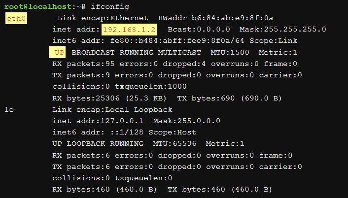

# LAN Card

## การ์ดเครือข่าย (Network Interface Card - NIC) 

เป็นอุปกรณ์ hardware ที่เป็นบอร์ดวงจรหรือชิปที่ติดตั้งบนคอมพิวเตอร์เพื่อใช้ในการเชื่อมต่อสายสัญญาณของเครือข่าย ติดตั้งไว้ในเครื่องคอมพิวเตอร์ที่เป็นเครื่องแม่ข่าย และเครื่องที่เป็นลูกข่าย เพื่อให้สามารถสื่อสารกับเครื่องคอมพิวเตอร์อื่น ๆ ในเครือข่าย 

การ์ดเครือข่ายจะเป็นจุดเชื่อมต่อระหว่างคอมพิวเตอร์ และระบบเครือข่าย ส่วนใหญ่จะเรียกว่า `NIC (Network Interface Card)` หรือบางทีก็เรียกว่า `LAN Card`
อุปกรณ์เหล่านี้จะทำการแปลงข้อมูลเป็นสัญญาณที่สามารถส่งไปตามสายสัญญาณหรือสื่อแบบอื่นได้  ปัจจุบันนี้ก็ได้มีการแบ่งการ์ดออกเป็นหลายประเภท   ซึ่งจะถูกออกแบบให้สามารถใช้ได้กับเครือข่ายประเภทแบบต่าง  ๆ  เช่น  อีเธอร์เน็ตการ์ด การ์ดในแต่ละประเภทอาจใช้กับสายสัญญาณบางชนิดเท่านั้น หรืออาจจะใช้ได้กับสายสัญญาณหลายชนิด

การ์ดเครือข่ายรุ่นใหม่มีฟังก์ชันที่ให้ความสามารถแก่คอมพิวเตอร์ เช่น การสนับสนุนสัญญาณ input/output interrupt, การทำ direct-memory access และการถ่ายโอนข้อมูล

## ประเภทของ LAN Card

โดยทั่วไปมาตรฐานของ NIC คือบอร์ดวงจรที่เสียบเข้ากับคอมพิวเตอร์เพื่อเชื่อมต่อกับเมนบอร์ด การเชื่อมต่อมีหลายวิธีดังนี้

- `Ethernet LAN card`: เป็น LAN card ที่ใช้เทคโนโลยี Ethernet ในการรับ-ส่งข้อมูล เหมาะสำหรับการใช้งานที่ต้องการความเร็วสูง ความเสถียร และความปลอดภัย


- `Wireless LAN card`: เป็น LAN card ที่ใช้คลื่นวิทยุในการรับ-ส่งข้อมูล เหมาะสำหรับการใช้งานที่ต้องการความยืดหยุ่น ใช้การเชื่อมต่อแบบ Wi-Fi ไม่จำเป็นต้องติดตั้งสายเคเบิล

- `Power over Ethernet (PoE) LAN card`: เป็น LAN card ที่รองรับการจ่ายไฟผ่านสายเคเบิล Ethernet เหมาะสำหรับการใช้งานกับอุปกรณ์ที่ต้องการการจ่ายไฟผ่านสายเคเบิล เช่น โทรศัพท์ IP

**เน็ตเวิร์คการ์ดจะติดตั้งอยู่กับคอมพิวเตอร์**

โดยเต้าเสียบเข้ากับช่องบนเมนบอร์ดของคอมพิวเตอร์   ส่วนมากคอมพิวเตอร์ที่ผลิตในปัจจุบันจะมีเฉพาะช่อง PCI ซึ่งก็ใช้บัสที่มีขนาด 32 บิต  อย่างไรก็ตามยังมีคอมพิวเตอร์รุ่นเก่าที่ยังมีช่องแบบ  ISA อยู่  ซึ่งมีบัสขนาด 16 บิต  และมีการ์ดที่เป็นแบบ  ISA จะประมวลผล ข้อมูลช้ากว่าแบบ  PCI


Source: https://uchukornsite.wordpress.com/%E0%B8%A3%E0%B8%B0%E0%B8%9A%E0%B8%9A%E0%B9%80%E0%B8%84%E0%B8%A3%E0%B8%B7%E0%B8%AD%E0%B8%82%E0%B9%88%E0%B8%B2%E0%B8%A2%E0%B8%84%E0%B8%AD%E0%B8%A1%E0%B8%9E%E0%B8%B4%E0%B8%A7%E0%B9%80%E0%B8%95%E0%B8%AD/%E0%B9%80%E0%B8%99%E0%B9%87%E0%B8%95%E0%B9%80%E0%B8%A7%E0%B8%B4%E0%B8%A3%E0%B9%8C%E0%B8%84%E0%B8%81%E0%B8%B2%E0%B8%A3%E0%B9%8C%E0%B8%94/

## หน้าที่ของ LAN Card หรือ NIC

มีหน้าที่ให้คอมพิวเตอร์เชื่อมต่อกับเครือข่ายอย่างต่อเนื่อง ทำงานในชั้น physical, สำหรับการสื่อสารกับมาตรฐานของชั้นข้อมูลเช่น Ethernet หรือ Wi-Fi โดยแปลงสัญญาณจากคอมพิวเตอร์ส่งผ่านไปตามสายสัญญาณ ทำให้คอมพิวเตอร์ในเครือข่ายแลกเปลี่ยนข้อมูลข่าวสารกันได้


- เป็นตัวกลางระหว่างคอมพิวเตอร์และเครือข่ายข้อมูล
  - เมื่อผู้ใช้ร้องขอหน้าเว็บ คอมพิวเตอร์จะส่งคำขอไปยังการ์ดเครือข่ายที่จะแปลงมันเป็นสัญญาณไฟฟ้า 

  - เซิร์ฟเวอร์เว็บบนอินเทอร์เน็ตรับสัญญาณและตอบโดยการส่งหน้าเว็บกลับไปที่การ์ดเครือข่ายเป็นสัญญาณไฟฟ้า การ์ดจะรับสัญญาณเหล่านี้และแปลงมันเป็นข้อมูลที่คอมพิวเตอร์แสดง
- แต่ละการ์ดแทนอุปกรณ์และที่มีสามารถทั้งเตรียม-ส่งออก และควบคุมการไหลของข้อมูลในเครือข่ายได้

- คอนโทรลเลอร์เครือข่าย เคยถูกนำมาใช้เป็นการ์ดเสริมที่สามารถเสียบเข้ากับพอร์ตคอมพิวเตอร์ หรืออุปกรณ์ USB แต่คอนโทรลเลอร์ที่ทันสมัยมักถูกนำมาติดตั้งโดยตรงในชิปเซ็ตบนเมนบอร์ดคอมพิวเตอร์ ผู้ใช้สามารถซื้อ NIC ในรูปแบบการ์ดเสริมออนไลน์หรือที่ร้านค้าปลีกถ้าต้องการการเชื่อมต่อเครือข่ายที่เป็นอิสระเพิ่มเติม เมื่อผู้ใช้เลือก NIC สเปกของมันควรสอดคล้องกับมาตรฐานของเครือข่าย

## หน้าที่ของ LAN Card บนระบบปฏิบัติการ Linux

Network Interface Card (NIC) มีบทบาทหลากหลายที่ทำให้ระบบเครือข่ายทำงานบน Linux ดังนี้

- **การตั้งค่า Network Interface**

  - NIC มีหน้าที่ในการตั้งค่าอินเตอร์เฟซของเครือข่ายบน Linux การใช้คำสั่งที่เกี่ยวข้องเช่น `ifconfig`, `ip`, หรือ `nmcli` เพื่อกำหนดค่า IP address, subnet mask, gateway และอื่น ๆ

- **การดูข้อมูล Network Interface**

  - NIC ให้ข้อมูลเกี่ยวกับสถานะและค่าต่าง ๆ ของอินเตอร์เฟซ เช่น IP address, MAC address และสถานะการเชื่อมต่อ คำสั่งที่ใช้สำหรับการดูข้อมูลรวมถึง `ifconfig`, `ip`, และ `ethtool`

- **การจัดการการเชื่อมต่อ**

  - NIC มีบทบาทในการจัดการและควบคุมการเชื่อมต่อ เช่น การรับ-ส่งข้อมูลระหว่างเครื่องคอมพิวเตอร์กับเครือข่าย เมื่อมีข้อมูลที่ต้องการส่ง NIC จะทำการสร้าง packet และส่งไปยังเครือข่าย, NIC จะรับข้อมูลจากเครือข่ายและนำเข้าระบบ

- **การสนับสนุนการโอนข้อมูล**

  - NIC มีความสามารถในการสนับสนุนการโอนข้อมูลด้วยวิธีต่าง ๆ เช่น DMA (Direct Memory Access) ช่วยให้ NIC สามารถโอนข้อมูลระหว่าง RAM ของคอมพิวเตอร์และ Buffer ของ NIC โดยไม่ต้องผ่านทาง CPU วิธีนี้ช่วยลดการใช้ทรัพยากรของ CPU ในกระบวนการถ่ายโอนข้อมูล

## หลักการทำงานของ LAN Card บน Linux

## ตรวจสอบการติดตั้ง LAN Card

ให้เช็คว่า LAN card ได้รับการติดตั้งแล้วหรือไม่ จะค้นหาไดรเวอร์ที่รองรับ LAN card ใน kernel ของ Linux เอง หรือในโมดูล kernel ที่ติดตั้งเพิ่มเติม ขั้นตอนมีดังนี้

**ตรวจสอบว่า kernel มีไดรเวอร์สำหรับ LAN card หรือไม่**

ใช้คำสั่ง `lspci` ใน Linux เพื่อแสดงรายการของ network card ทั้งหมดที่ติดตั้งบนระบบ พิมพ์คำสั่ง `lspci` ตามด้วยคำสั่ง `egrep` เพื่อกรองอุปกรณ์ที่เกี่ยวข้อง
```
lspci | grep -i network
```

ผลลัพธ์ที่ได้

```
09:00.0 Ethernet controller: Broadcom Corporation NetXtreme BCM5761e Gigabit Ethernet PCIe (rev 10)
0c:00.0 Network controller: Intel Corporation Ultimate N WiFi Link 5300
```

---

ใช้คำสั่ง `lshw` สามารถดึงข้อมูลรายละเอียดเกี่ยวกับการกำหนดค่า hardware ของเครื่องได้ รวมถึงข้อมูลเกี่ยวกับ network card

```
lshw -class network
```
ผลลัพธ์แสดงรายละเอียดข้อมูล hardware ที่เกี่ยวกับ network card บน Linux
```
  *-network DISABLED      
       description: Wireless interface
       product: Ultimate N WiFi Link 5300
       vendor: Intel Corporation
       physical id: 0
       bus info: pci@0000:0c:00.0
       logical name: wlan0
       version: 00
       serial: 00:21:6a:ca:9b:10
       width: 64 bits
       clock: 33MHz
       capabilities: pm msi pciexpress bus_master cap_list ethernet physical wireless
       configuration: broadcast=yes driver=iwlwifi driverversion=3.2.0-0.bpo.1-amd64 firmware=8.83.5.1 build 33692 latency=0 link=no multicast=yes wireless=IEEE 802.11abgn
       resources: irq:46 memory:f1ffe000-f1ffffff
  *-network
       description: Ethernet interface
       product: NetXtreme BCM5761e Gigabit Ethernet PCIe
       vendor: Broadcom Corporation
       physical id: 0
       bus info: pci@0000:09:00.0
       logical name: eth0
       version: 10
       serial: b8:ac:6f:65:31:e5
       size: 1GB/s
       capacity: 1GB/s
       width: 64 bits
       clock: 33MHz
       capabilities: pm vpd msi pciexpress bus_master cap_list ethernet physical tp 10bt 10bt-fd 100bt 100bt-fd 1000bt 1000bt-fd autonegotiation
       configuration: autonegotiation=on broadcast=yes driver=tg3 driverversion=3.121 duplex=full firmware=5761e-v3.71 ip=192.168.1.5 latency=0 link=yes multicast=yes port=twisted pair speed=1GB/s
       resources: irq:48 memory:f1be0000-f1beffff memory:f1bf0000-f1bfffff
```

แสดงผลลัพธ์แบบสั้น ใช้คำสั่ง

```
sudo lshw -class network -short
```

```
[sudo] password for vivek:
H/W path           Device        Class          Description
===========================================================
/0/100/1d.6/0      wlp82s0       network        Wi-Fi 6 AX200
/0/100/1f.6        eth0          network        Ethernet Connection (7) I219-LM
```

> [!WARNING]
> - โดยปกติแล้วคำสั่ง `lshw` อาจจะยังไม่ได้ถูกติดตั้งในระบบ ใช้คำสั่งดังนี้ เพื่อติดตั้ง `lshw`
>   - `sudo apk add lshw` บน Alpine Linux
>   - `sudo dnf install lshw` หรือ `sudo yum install lshw` บน RHEL
>   - `sudo apt install lshw` หรือ `sudo apt-get install lshw` บน Debian Ubuntu
>   - `sudo zypper install lshw` บน SUSE
>   - `sudo pacman -S lshw` บน Arch Linux 

---

## การตั้งค่า IP address กับ LAN Card บน Linux


หาก LAN card ได้รับการติดตั้งและถูกตรวจจับอย่างถูกต้อง ต้องกำหนดค่า IP address, subnet mask, gateway, DNS server ด้วยตนเองโดยใช้ไฟล์ `/etc/network/interfaces` หรือเครื่องมือ `ifconfig`

```
/etc/network/interfaces
```
```
auto eth0 
iface eth0 inet static
    address 192.168.1.2
    netmask 255.255.255.0
    gateway 192.168.1.1
    dns-nameservers 8.8.8.8 8.8.4.4
```
- `auto eth0`: ตั้งค่าให้ระบบเปิดใช้งาน eth0 โดยอัตโนมัติเมื่อบูทเครื่อง
- `iface eth0 inet static`: ตั้งค่า eth0 ใช้งาน IPv4 แบบ static
- `address 192.168.1.2`: ตั้งค่า IP address ของ eth0 เป็น 192.168.1.2
- `netmask 255.255.255.0`: ตั้งค่า subnet mask ของ eth0 เป็น 255.255.255.0
- `gateway 192.168.1.1`: ตั้งค่า gateway ของ eth0 เป็น 192.168.1.1
- `dns-nameservers 8.8.8.8 8.8.4.4`: ตั้งค่า DNS server ของ eth0 เป็น 8.8.8.8 และ 8.8.4.4

การตั้งค่า IP address ด้วยคำสั่ง `ifconfig` คือการกำหนดค่า interface และใช้เพื่อแสดงข้อมูลการกำหนดค่าเครือข่าย บนเครื่องคอมพิวเตอร์ และสามารถดูข้อมูลเกี่ยวกับ network interface ได้ เช่น IP address, MAC address, network mask เป็นต้น

```
ifconfig
```


Source : https://content.netdevgroup.com/contents/linux-essentials/pvycrLF82S/

คำสั่งนี้แสดงผลลัพธ์รายละเอียดซึ่งรวมถึงข้อมูลเกี่ยวกับ network interface ทั้งหมดที่กำลังทำงาน เช่น ชื่อinterface, ที่อยู่ hardware, ที่อยู่ IP และรายละเอียดการกำหนดค่าอื่น ๆ ของทุกๆ interface ที่ทำงานอยู่ในปัจจุบัน

**ตัวอย่างคำสั่งเปิดการใช้งาน ifconfig | up**

```
ifconfig eth0 192.168.1.2 netmask 255.255.255.0 up
```

- `ifconfig eth0`: เลือก eth0
- `192.168.1.2`: ตั้งค่า IP address ของ eth0 เป็น 192.168.1.2
- `netmask 255.255.255.0`: ตั้งค่า subnet mask ของ eth0 เป็น 255.255.255.0
- `up`: เปิดใช้งาน eth0

```
eth0: flags=4163<UP,BROADCAST,RUNNING,MULTICAST>  mtu 1500
        ether 00:50:56:c0:00:08  txqueuelen 1000  (Ethernet)
        RX packets 1534 bytes 1228328 (1.1 MiB)
        RX errors 0 dropped 0 overruns 0 frame 0
        TX packets 1467 bytes 118720 (115.8 KiB)
        TX errors 0 dropped 0 overruns 0 carrier 0 collisions 0
```

> [!WARNING]
> - ตรวจสอบให้แน่ใจว่า `IP address 192.168.1.2` ไม่ได้ถูกใช้งานโดยอุปกรณ์อื่นบนเครือข่าย
> - ตรวจสอบให้แน่ใจว่า `subnet mask 255.255.255.0` ถูกต้อง
> - ตรวจสอบว่าสายเคเบิล LAN เชื่อมต่อกับพอร์ต Ethernet ของคอมพิวเตอร์และ routers


## การเปิดใช้งาน (UP) และปิดใช้งาน (DOWN) พอร์ต Network Interface Card (NIC) บน Linux

### เปิดใช้งาน NIC eth0
```
ifconfig eth0 up
```
- เปิดใช้งาน NIC (Network Interface Card) ที่ระบุ
- อนุญาตให้คอมพิวเตอร์สื่อสารผ่านเครือข่าย
- สามารถกำหนดค่า IP address และ subnet mask เองได้

```
eth0: flags=4163<UP,BROADCAST,RUNNING,MULTICAST>  mtu 1500
        ether 00:50:56:c0:00:08  txqueuelen 1000  (Ethernet)
        RX packets 1534 bytes 1228328 (1.1 MiB)
        RX errors 0 dropped 0 overruns 0 frame 0
        TX packets 1467 bytes 118720 (115.8 KiB)
        TX errors 0 dropped 0 overruns 0 carrier 0 collisions 0
```
___
### ปิดใช้งาน NIC eth0
```
ifconfig eth0 down
```
- ปิดใช้งาน NIC ที่ระบุ
- ห้ามคอมพิวเตอร์สื่อสารผ่านเครือข่าย
- ล้างค่า IP address, subnet mask, gateway และ DNS server


```
eth0: flags=4099<UP,BROADCAST,MULTICAST>  mtu 1500
        ether 00:50:56:c0:00:08  txqueuelen 1000  (Ethernet)
        RX packets 1534 bytes 1228328 (1.1 MiB)
        RX errors 0 dropped 0 overruns 0 frame 0
        TX packets 1467 bytes 118720 (115.8 KiB)
        TX errors 0 dropped 0 overruns 0 carrier 0 collisions 0
```

> [!WARNING]
>
> **ข้อควรระวังการใช้งาน LAN Card**
> - การเลือก LAN Card ที่รองรับ
>   - ตรวจสอบให้แน่ใจว่า LAN Card ที่คุณเลือกนั้นรองรับ Linux
> - การกำหนดค่า LAN Card
>    - หลังจากติดตั้งไดรเวอร์แล้ว ต้องกำหนดค่า LAN Card สามารถทำได้โดยใช้ไฟล์ `/etc/sysconfig/network-scripts/ifcfg-ethX` โดยที่ `ethX` คือชื่ออินเทอร์เฟซ NIC ของคุณ

## 📚 Reference

- https://www.cyberciti.biz/faq/linux-list-network-cards-command/
- https://www.baeldung.com/linux/list-network-cards
- https://www.baeldung.com/linux/network-interface-configure
- https://amod-kadam.medium.com/linux-network-interface-s-minimal-know-how-helped-me-a-lot-168547b471d9
- https://content.netdevgroup.com/contents/linux-essentials/pvycrLF82S/
- https://uchukornsite.wordpress.com/ระบบเครือข่ายคอมพิวเตอ/เน็ตเวิร์คการ์ด/
- https://www.2daygeek.com/enable-disable-up-down-nic-network-interface-port-linux/

